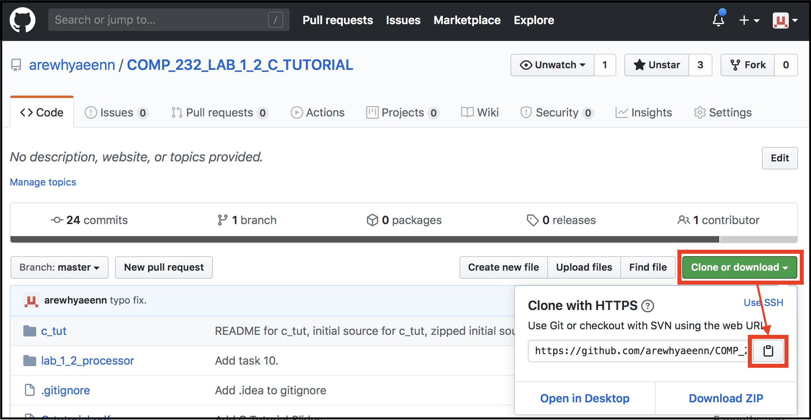
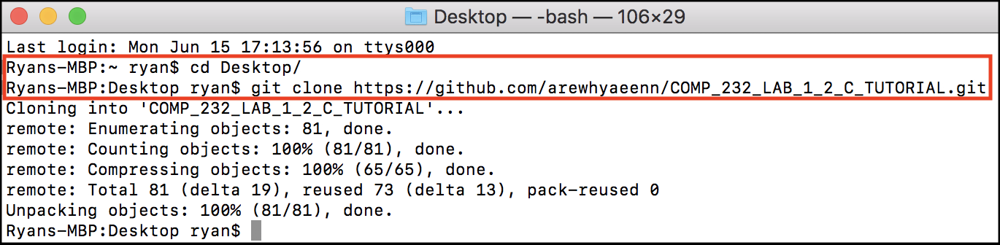
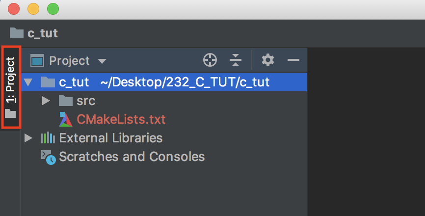
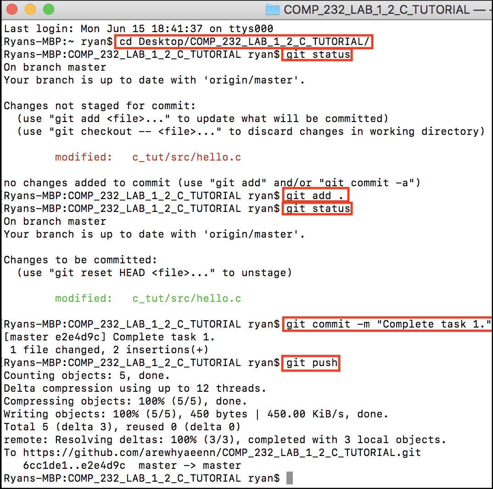

# COMP 232 - C Tutorial

This lab consists of eleven tasks. The first one deals with setting up and testing your environment, and it should be a minimal goal for completion on the first day of lab. The next eight are introductory tasks, to learn and practice the basic functionalities of C. You will find the [C tutorial slides](./C_tutorial.pdf) helpful; they provide information on the basics of C, and the information provided will be crucial to complete each task. The slides are password protected with password `comp232`. The tenth task is a larger program in which you'll practice the things you learned in the previous tasks. In the final task, you will combine your newfound knowledge of C with your prior knowledge of data structures to build a linked list implementation and a simple application to utilize that implementation.

The tasks should be done sequentially; skills learned in earlier tasks will be needed in later tasks.

Your submission must include screenshots of sample runs of every program. These screenshots must be named adequately to easily identify which screenshot corresponds to which task.

It is recommended, but not required, that you create documentation (in text or markdown form) as you go through the lab. For each task, your documentation could include:

* A brief summary of the task and/or the new concepts learned in the task.
* Questions you had along the way, and their answers if you found them (if applicable).
* Descriptions of any known issues / bugs (if applicable).

This documentation is your "journal", tracking and displaying your progress and providing you with personal notes to look back on later on; taking the extra 5 minutes to reflect and write good (readable, clean) notes for your future reference will save you time in the long run.

# TASK 1 - Set up your environment

The information below will help you set up an environment on your personal computer using CLion, a JetBrains IDE.

Students may instead choose to work in the cloud, using Amazon's Cloud9 IDE. This requires some administration on my part; students wishing to use Cloud9 instead should contact me for further instruction. This is the first semester for which we are offering Cloud9 support, so we are basically guaranteed to run into novel issues; choosing this option is essentially volunteering to be a COMP 232 beta tester.

## Register for JetBrains

As a student, you can (and should) sign up for a free (year long) JetBrains license [here](https://www.jetbrains.com/student/). This will allow you to use CLion, the JetBrains IDE for programming in C.

## Install CLion

Install CLion, which you can download [here](https://www.jetbrains.com/clion/download/).

If you are using Windows, follow the instructions [here](https://www.jetbrains.com/help/clion/how-to-use-wsl-development-environment-in-clion.html) to set up WSL (Windows Subsystem for Linux) and configure CLion for use with WSL.

Windows users have many other options; there are C compilers for Windows (Cygwin, MinGW, ...), dual-booting, virtual machines, etc. C compilers for Windows **are not adequate** for this class; this is not because any issues with the compilers themselves, but because Valgrind Memcheck (the next tool you'll install) doesn't exist on Windows. You can absolutely use any of the other alternatives, to the extent that you deal with installation issues and environment differences independently.

## Install Valgrind Memcheck

Valgrind Memcheck is a tool which detects errors in memory allocation and use in C and C++ programs. Install Valgrind Memcheck.

##### Mac:

First, [install homebrew](https://brew.sh), a package manager for MacOS (unless you already have it; you can check by typing `brew --version` in the terminal). As the linked instructions state, install homebrew by opening the terminal and pasting this command:

`/bin/bash -c "$(curl -fsSL https://raw.githubusercontent.com/Homebrew/install/HEAD/install.sh)"`

Then, use homebrew to install Valgrind Memcheck with the command:

`brew install valgrind`

Then, check out [CLion's Valgrind configuration page](https://www.jetbrains.com/help/clion/memory-profiling-with-valgrind.html) to configure CLion for use with Valgrind.

##### Windows (WSL):

If you are using WSL, [CLion's Valgrind configuration page](https://www.jetbrains.com/help/clion/memory-profiling-with-valgrind.html) includes your installation instructions. Follow the installation and configuration instructions.

If you have chosen instead to use a virtual machine, to dual-boot, or something of the sort, you're on your own. Use that search engine.

##### Any other environment:

You are strong, capable and independent. Use that google-fu. Trust your instincts, and then forgive them when they mislead you. I believe in you.

## Install Git

Git is a decentralized version control system.

Watch [this video](https://www.youtube.com/watch?v=SWYqp7iY_Tc) explaining the basics of git.

Git's primary purpose is to allow multiple people to work remotely on the same code base; we will not be using it for this purpose (labs will be individual), but you will use it in future classes (Software Engineering) and in industry.

We will be using git's basic functionality with Github to:

* store and view lab work in online repositories
* provide lab feedback

(think Google Drive, but for programming projects).

For our purposes, you only need to understand the following commands:

* `clone`
* `status`
* `add`
* `reset`
* `commit`
* `push`
* `pull`

Your workflow for labs will generally be:

1. Clone the lab repository.
2. Do the lab.
	* Make commits along the way, as you complete tasks.
	* Push occasionally; keep your online back up up-to-date with your progress.
3. When you're done, commit and push your completed lab.

If you're a bit fuzzy on what purpose git serves and how it's used, don't worry too much; it will likely become more clear as you go through the next section.

You most likely already have git installed. Try `git --version` to find out.

If you don't already have git, follow the instructions [here](https://git-scm.com/book/en/v2/Getting-Started-Installing-Git) corresponding to your operating system.

## *Hello World!* in C and the the Git workflow

### 1. Copy the lab repository URL to the clipboard

Go to the repository github page (you should already be there, it's where these instructions are). Click the button shown below:



### 2. Clone the repository

In your terminal, navigate to the desired repository location (I put mine on the destop below) and clone the repository with `git clone <url>`.



If you, like me, chose to clone the repository onto your desktop, you should be able to see the repository folder on the desktop. If you chose to put it somewhere else, you can find it with your file explorer. Check out the contents of the cloned repository, and compare them to the contents shown on your repository Github page.

### 3. Open the `c_tut` project

Open CLion, select *Open*, find your repository folder, select the `c_tut` folder inside of it and click *Open*. In the Project panel (on the left), you should be able to expand the `c_tut` folder and its contained `src` folder to see the contents of the project. You can double click files in to open them in editor panes. I've left the `src` folder closed for the screenshot below:



If the project panel isn't open by default, click the button outlined in red in the screenshot to show it.

### 4. Build the project

This entire project was last edited on a different computer than yours! We should make sure we can build it in your environment.

1. In the *File* menu and select *Reload CMake Project*.
2. In the *Build* menu, select *Build Project*.

### 5. Run `hello.c`

You're now ready to run your first program. There are three ways that we'll be running programs, and you should test all three here (in order).

##### Standard Run

In CLion, open the *Run* menu and select *Run...*. A list of all of the executables in the `c_tut` project will appear. From the list of executables, select `hello`.

Check your `CMakeLists.txt`; each line that starts with `add_executable(...)` names an executable (like the one you just ran) and lists which file(s) the executable relies on. Find the line that starts with `add_executable(hello ...)`. Which file is used in the `hello` executable? Open that file in an editor pane by double clicking it in the project pane. Compare its contents to the output in the console; once you're comfortable that you understand this program, you're ready to move on.

##### Debug Run

The debugger is an incredibly useful tool. If you are used to tediously debugging with print statements, your days of suffering are over!

You should have `hello.c` still open in an editor pane. If it isn't open, reopen it. Add the line `int x = 0;` in the main, before the `printf` call.

On the left side of this editor pane, between the line numbering and the text editor itself, click on the line where you just added `int x = 0;`. A red dot should appear between the line number and the text editor. This is called a *breakpoint*. Put another breakpoint on the line with the `printf` call. You should now have 2 breakpoints (2 red dots), one on the line with `int x = 0;` and a second on the line with `printf(...);`.

In the *Run* menu, select *Debug...* . Again, choose the `hello` executable. This will run the `hello` executable with the debugger. Note that because `hello` is the last executable that was run, you could instead just choose *Debug 'hello'* in the *Run* menu to shorten the process.

The executable should have run, but stopped on the first breakpoint, on the line that says `int x = 0;`, which should be highlighted. The program has stopped running just **before** this line would execute. So, `x` has not yet been declared or given the value 0.

You should have two tabs available at the bottom where the console normally is; in addition to the *Console* tab, there is now a *Debugger* tab. Select the *Debugger* tab if it is not already selected.

Within the *Debugger* tab there are two smaller tabs available: *Variables* and *LLDB*. The *Variables* tab should be selected (if it isn't, select it), and there should be no variables displayed in it. This is because at the current stage in executing the `hello` executable, no variables have been created.

To the right of the *Debugger* and *Console* tab selection, there should be several buttons (with red, green and blue lines and arrows). If you mouse over each button and look at the bottom left of the CLion window, you will see a description of what that button does. Find the button that allows you to step to the next line in your current file, and click it.

The highlighted line should have moved from `int x = 0;` to `printf(...);`. So, now our executable is waiting just before running the `printf` call; nothing should have appeared in the *Console* tab. However, in the debugger's *Variables* tab, you should now have a variable named `x`, which is an `int` with value `0`.

As you go through this tutorial, you should practice and experiment with the debugger! Debugging by printing is tedious in general, but it is particularly tedious in C for reasons we'll discuss when printing to log files in our final project. The debugger becomes **easy and convenient** with a little familiarity. Trust me, the debugger is your friend.

##### Valgrind Memcheck Run

Finally, open the `Run` menu and select `Run 'hello' with Valgrind Memcheck`. Now, next to the `Console` tab (which should contain the same old printed message that both other runs have) you should have a `Valgrind` tab as well. Click the `Valgrind` tab. In this window tab, you will have information about memory issues in your program. 

In C, we have the power to reserve precisely sized chunks of memory in which to store data (memory **allocation**), to read and manipulate the bytes in the reserved space (memory **accessing**, **reading**, **writing**), and to free up that memory so it can be used for another purpose when we're done using the data we've stored in it (memory **deallocation**). We will learn how all of these actions are carried out later in this tutorial.

Valgrind's output will tell you if you're accessing memory that you shouldn't be accessing (**unallocated** memory), if you're leaving memory allocated after its done being used (**leaking** memory), and so on.

Valgrind is far from perfect. It often has inaccurate messages stating `Leak Possibly Lost`, meaning that it thinks you **might** have allocated some memory and forgotten to free that space up later. In general, if Valgrind says `Leak Possibly Lost` you are safe to ignore it for the scope of this course (particularly if the referenced lines where leaking might be happening were not written by you, and are instead part of a standard library being used).

However, when Valgrind is **sure** memory is being leaked, you should listen to it. If it ever says `Leak Definitely Lost`, and you're **absolutely certain** that there are no errors in your program and that no memory is being leaked, **you are wrong**.

Valgrind has other messages for illegal accessing of memory. If you read the data at an address in memory that is not allocated, it will warn you of an `Invalid Read`. Invalid reads are bad - the unallocated memory is free for use by any new data being stored, so that unallocated memory that you're reading may have its contained data changed at any time with no warning, meaning the data that is being read can change unpredictably. If you are writing to memory that is unallocated, Valgrind will warn you of an `Invalid Write`. Invalid writes are bad, because whatever data you just stored may be overwritten, as the space it was written in is not reserved for it. Either of these types of errors can lead to unpredictable and inconsistent errors in normal runs, and they can be very difficult to debug with normal runs. Valgrind helps to detect these errors, which makes them much easier to identify and fix.

Any program that you create that involves manual memory allocation should be tested and debugged with Valgrind. Programs which leak memory or perform illegal accesses will lose points.

If all this about memory and allocation doesn't make sense to you right now, don't stress it. Come back and reread the Valgrind section above when you start allocating memory later on!

### 6. `commit` your changes and `push` them to Github

1. In your terminal, navigate into your repository. Mine was on my desktop, so for me this was done by opening a new terminal and running `cd Desktop/232_C_TUT`.
	* On MacOS, you can type `cd` and then drag the repository folder into the terminal window to paste its path, then press enter.
	* On Windows 10, you can navigate into your repository in the file explorer and then shift-right-click and choose *Open Powershell window here* or *Open Linux shell here*.
2. Check the status of the repository by doing `git status`; this will tell you which files have been changed / deleted / added since you cloned it (or since your last commit, if you've deviated and made one after cloning). It should show that `c_tut/src/hello.c` has been modified, but that those changes are not staged for commit.
3. `add` your changes to the staging area. This can be done with `git add .` to add all changes in the current working directory, or with `git add *` to add all changes in the whole repository. In this case, both are identical to `git add ./c_tut/src/hello.c`, because `c_tut/src/hello.c` is the only modified file.
4. Run `git status` again. `c_tut/src/hello.c` should now show as modified and staged for commit.
5. `commit` the staged changes: `git commit -m "Complete task 1."`
	* The `-m` tag specifies that a commit message will be provided, and the `"Complete task 1."` is the message itself. Commit messages should **briefly** describe what changes have been made since the last commit.
	* If you just do `git commit`, you'll end up typing the commit message in vim. If you end up here, just know that you quit vim (after changing the commit message) by typing `:q` to finish the commit.
6. `push` your changes to Github with `git push`. The online repository is updated to match your local copy.
	* you will be prompted for credentials (unlike the screenshot below) unless you've done some additional configuration with git; the credentials that you'll need to enter are your Github username and password.



Refresh your github repository page! You should be able to see you changes backed up in the online copy. Once you push, I'll be able to see all of your commits in your github repository too.

You should commit regularly, in small chunks. When you're with any lab, I should be able to look at your commit history and see a series of commits telling me the story of your lab progress, **not** a single commit with a message stating that you "did the whole lab".

You should also push regularly. I personally push every time I commit, because I always want my work backed up online, but this is admittedly a bit overzealous.

### 7. Celebrate!

CONGRATULATIONS! You've finished setting up and testing your environment, and making your first commit for this class! The biggest headache of the semester is done!

The remaining tasks will deal with programming in C. Use the [C tutorial slides](./C_tutorial.pdf) as a reference throughout. Recall, the password to open the slides is `comp232`.

# TASK 2

Open `types.c`, and run it (you will need to respond to prompts in the console).

Ensure that you understand what each line does (even if you're not positive how it does it).

Once you're certain that you understand what the program is doing, modify it so that it:

* asks for the number of faculty in addition to the number of students.
* prints the ratio of students to faculty (truncated at 1 decimal place).

Test your modified program with several different inputs. Ensure that it works even if the ratio of students to faculty is not a whole number!

You may want to explore the documentation for `scanf` and `printf` in the manual; open the terminal and type `man printf` to see its manual entry. The same will work for `scanf`, and for other built-in functions in C.

Before you move on, you should be able to answer the following questions:

* What do the `"%d"` format strings in the `scanf` and `printf` calls mean?
* What does the `&` operator in the `scanf` call do?
* What format string would you use to print a `double` with 1 decimal point precision? How about a `float`?

# TASK 3

Open `if-then-else.c`. Read the program and ensure that you understand what it will do for different values of the `level` variable.

Note the preprocessor definition of the `DANGER_LEVEL` constant. In general, when you want to use a magic number (i.e. a hard-coded literal value), you should do this instead.

Modify the code so the value of the `level` variable is read from the standard input (i.e. from the console) as a character. Note that whenever you expect a user to respond in the standard input, you should prompt them, asking for what you want.

Replace the `if/else` statement with a `switch` whose input is the character input by the user, converted to lowercase. The only valid inputs are `e`, `f`, or `h` for "empty", "full" and "half full". Print an appropriate message telling the user how full the tank is based on their input. 

"Huh? What tank?" you ask. No. No context. Only C.

If an invalid input is given by the user, an error message should be printed. To clarify, this means that you should print a message stating that the input was invalid; the error message should come from you, it should not be a runtime error.

You may find the following functions useful:

* `puts`
* `getchar`
* `tolower`

You should look them up in the C manual by typing `man` followed by the function names in the terminal, like we did with `printf` and `scanf` earlier.

Note that to use the `tolower` function, you must include `ctype.h` (just like `stdio.h` is already included at the top of `if-then-else.c`). You can tell that this import is needed by reading the manual entry for `tolower` (see the first line of the synopsis).

You can also access the manual through CLion. Put the cursor on the function call for which you would like to see documentation and hit the `f1` key.

# TASK 4

Modify `array.c` so that it reads doubles from the standard input and computes their average.

The number of doubles to read should first be read from the standard input. For example, a sample run might look like:

```
Provide a desired number of doubles?
5

Provide the doubles?
1.0 2.0
3.0 
4.0 5.0

Data: 1.0 2.0 3.0 4.0 5.0
Average: 3.0
```

Note that `scanf` with the proper format string (i.e. one to read a double) will search for doubles in the standard input independent of the placement on the input line, so inputs should be accepted if they are on the same line or on different lines or some mix of these.

A maximum number of doubles that the program can handle is defined by the `MAX_NUM_OF_CELLS` definition. Your program should create an array with that many elements. It should also verify that the number of elements entered by the user is no larger than this limit and that the number of elements entered by the user is at least 1. If the user enters 0 or a negative input for the number of doubles, then the number read should default to 1. If the user enters a number which is too large, the number of inputs should default to `MAX_NUM_OF_CELLS`. In either of these cases, a message should be printed informing the user of their mistake, and of what was done to compensate for their mistake.

The program should print all of the input doubles on one line, separated by spaces, and should then print the average on the next line (see sample run above).

# TASK 5

Examine the code in `strings.c`, `pointer.c`, and `mem-alloc.c`.

In each of these three programs, set breakpoints on every statement. Then, run the program with the debugger. Step through each program, checking the value of each variable after each line is executed to ensure you understand what is happening (and don't hesitate to ask for explanation if you're not sure why something is behaving the way it is). Recall that the breakpoint highlighted by the debugger has not yet been executed (the debugger stopped just **before** its execution).

Use `strings.c`, `pointer.c`, and `mem-alloc.c` as examples to implement a new program in file `words.c`. 

To create a new file in CLion in the `src` directory of your project:

1. Right-click on the `src` directory in the project pane on the left (control click if you're on a Mac in 1-button mouse mode).
2. Select `New` from the menu, and then `C/C++ Source File`, and a new file dialog will open.
3. In the new file dialog, provide a name for the file by typing `words`; note that you do not need to type `words.c`, CLion will handle the extension for you (see the next step).
4. Select `.c` from the `Type` menu.
5. Uncheck `Add to targets`.

Now that you've created a new file, you need to create a new executable which runs that file. Configurations for executables (among other things) can be handled in the `CMakeLists.txt`.

Open `CMakeLists.txt`. Note the lines creating executables. They are in the form `add_executable(<executable_name> <included_files>)`. For instance, the line `add_executable(array src/array.c)` creates an executable named `array` consisting of one file, `src/array.c`.

Make a new executable, named `words`, whose source is the `words.c` that you just added to the `src` file.

Whenever `CMakeLists.txt` is edited, the project needs to be reloaded to be updated. In the `File` menu, select `Reload CMake Project`.

Finally, you can write your new program in `words.c`. It should:

* Read words from the standard input until the word "END" is found.
* Count all words read (except the sentinel "END")
* Store the words in an array of strings

After the sentinel has been read, it should:

* Print the number of words that have been read.
* Print the array of words, 1 word per line.

A sample run might look like:

```
Enter words (enter "END" to stop):
veni vidi
vici
END

The following 3 words have been read:
veni
vidi
vici
```

The strings will be stored in an array of pointers (type `char*`, i.e. "character pointer"). Much like in the previous task, this array will have an arbitrary maximum size, which should be defined with a preprocessor `#define`. If the array is filled before the sentinel "END" is encountered, the program should print a message stating that there is no more space, and then continue as if the user had entered the sentinel.

Initially, the pointers will have invalid values (whatever junk was in the space now being used for the pointers); they must be given the address of the space allocated for a string using `malloc` or `calloc`.

The words will can have varying lengths; you will need a buffer in which to store each new input word while you allocate space for it. This buffer will need an arbitrary size (larger than you expect any input words to be), which should be defined with a preprocessor definition.

The process for reading a word is something like:

1. Use `scanf` to read a new word into the buffer.
2. Ensure that the last character in the buffer is `\0` (the null character, often called a **null terminator** in C because it is used to end strings). This is necessary if the word entered was too large to fit in the buffer.
3. Use `strlen` to find the length of the string stored in the buffer.
4. Use `malloc` or `calloc` to allocate enough space for the string (and store the resulting pointer in the words array). Note that you will need 1 extra byte in your allocated space for the null terminator.
5. Use `strcpy` to copy the string in the buffer into the newly allocated space. Note that `strcpy` will put a null terminator at the end of the copied string, so you don't need to.

Note that you are manually allocating space for the strings with `malloc` or `calloc`, so you must free up that space when you're done by using `free`. Freeing should happen when you're done accessing the strings, so in this case, after you print them. Test with Valgrind to ensure that you remove any memory leaks, as well as any invalid reads or writes.

You may find it useful to check out the manual pages for

* `scanf`
* `malloc`, `calloc` and `free`
* `strlen`, `strcpy` and `strcmp`

# TASK 6

In this task, you will learn to read and write files in C.

Note that the default working directory in CLion is the `cmake-build-debug` directory. So, if you want to create or read files, you will need to provide a path from that directory to the location of the file being read or the desired location of the file being written.

You can change the working directory for an executable in that executables run configurations by opening the `Run` menu, selecting `Edit Configurations`, finding the executable you wish to edit and changing its working directory there (this will not be necessary in this task, just FYI).

Creat a file called `data.txt` in the `cmake-build-debug` directory by right-clicking the directory in the project pane, selecting `New`, and finally selecting `File` from the resulting options. Enter the file name (including the extension), and click `Ok`.

The new file should be automatically opened in an editor pane. If it isn't, find it in the `cmake-build-debug` directory in the project pane, and double click it.

Type some stuff in the file. It doesn't really matter what stuff. There are no mistakes here, only happy accidents. Don't forget to save the file!

Open `file.c`. Extend it so it reads all data from `data.txt` and writes this data to a new file. The name of the new file should be requested from the user.

Note that because the default working directory is `cmake-build-debug`, the new generated file will be there as well unless a path elsewhere is specified. For example, if you want the new file to be in the `src` directory, you could take the user's entry of "data2.txt" and create a file `../src/data2.txt`.

Data should be copied from `data.txt` into the new file (with the users provided name) one character at a time. All files should be closed before the program ends!

You may want to explore the manual pages for:

* `fgetc`
* `fputc`
* `fopen`
* `fclose`
* `fscanf`

# TASK 7

`prt-arg-2.c` contains an implementation of a function `swapIntegers`, which swaps the values of two integers using their addresses (i.e. using pointers to the integer data). Add and test a function `swapStrings` that will swap two strings.

DO NOT use `strcpy`. The characters comprising the strings do not need to be moved or changed in any way. Instead, the addresses pointed to by the string variables should be swapped.

As always, the debugger is your friend. Things start to get tricky here, and you may find it useful to draw a memory diagram of the characters and of the strings. Note that in C these "strings" are really character pointers (`char*`s), referencing the location in memory of the first character in a contiguous sequence of characters.

# TASK 8

Read `ptr-func.c`. Once you understand what it is doing, create a new file `calc.c` which implements a simple calculator. The calculator will perform the four basic arithmetic operations `+`, `-`, `*` and `/`. The program should prompt the user for the operation to perform in an endless loop. For example:

```
calc > 3 + 6
9
calc >
```

You must implement the calculator such that there is one `calc` function which takes as arguments the numerical values of the two operands and a pointer to the specified function (`add` for `+`, etc), plugs the two values into the referenced function, and returns the result.

Your program should work independent of spaces in the input. For instance, both `1+2` and `1 + 2` should work. This is actually very easy to do with `scanf`, check out its manual page!

# TASK 9

Using `struct.c` as a starting point, implement an application that creates a database of employee records. Your implementation will need to:

* Define the structure `PERSON`, in a header file called `person.h`, which you will need to create in the `src` directory.
	* The struct's contents are in the [C tutorial slides](./C_tutorial.pdf).
	* A `typedef` should be used to reference the stucture as `PERSON` instead of as `struct person`.
* Create an `employees` array (an array of `PERSON *`s) in the main file (`struct.c`)
* In a new file, `person.c`, implement functions:
	* `addEmployee` : reads personnel data from the standard input, populates an element in the `employees` array.
	* `displayEmployee` : takes as input a pointer to a `PERSON` and displays (i.e. prints) the information for that person in a readable format.
	* `displayAllEmployees` : to display all employees in the array (by calling `displayEmployee` on each element.
* Finally, the main program (in `struct.c`) which will need to:
	* Prompt first for the number of employees.
	* Create the `employees` array with the correct size.
	* Call `addEmployee` the specified number of times.
		* You will first need to allocate space for a `PERSON`, and store the resulting `PERSON *` in the employees array.
	* Call `displayAllEmployees`.
	* Free all allocated space.

Here are the signatures of the functions that must be declared in `person.h` and defined in `person.c`:

```
void addEmployee(PERSON *employee);
void displayEmployee(PERSON *employee);
void displayAllEmployees(PERSON *employees[], int numberOfEmployees);
```

Don't forget:

* Include `person.h` in both `person.c` and in `struct.c` so `person.c` can define the functions declared in `person.h` and so `struct.c` can reference those functions.
* Add `person.c` to the `struct` executable in `CMakeLists.txt`, so the definitions from `person.c` are available when the executable is compiled.

A sample run might look like:

```
How many employees?
4

Enter information for the next employee.
Name : Bob Ross
Age : 54
Height : 1.2
Birthday ( MM / DD / YYYY ) : 11/22/3333

Enter information for the next employee.
Name : Idk someone with a name
Age : 980
Height : 18.5
Birthday ( MM / DD / YYYY ) : 13 / 37 / 1337

Enter information for the next employee.
Name : Arnold Shwa... how2spell
Age : 72
Height : 180.3
Birthday ( MM / DD / YYYY ) : 7 / 30 / 1947

Enter information for the next employee.
Name : yes
Age : 1
Height : 1
Birthday ( MM / DD / YYYY ) : 1/1/1

Displaying Employees...

Bob Ross : 
	Age : 54
	Height : 1.2
	Birthday : 11/22/3333

Idk someone with a name : 
	Age : 980
	Height : 18.5
	Birthday : 13/37/1337

Arnold Shwa... how2spell : 
	Age : 72
	Height : 180.3
	Birthday : 7/30/1947

yes : 
	Age : 1
	Height : 1.0
	Birthday : 1/1/1

Process finished with exit code 0
```

# TASK 10

Use CLion to open the `processor` project in your lab repository. It will serve as a starting point for task 10.

Your task is to implement a program that processes batches of messages.

Messages will come in 4 types:

* `MSG_TYPE_1` : An arbitrary string
* `MSG_TYPE_2` : 4 integers, separated by spaces 
* `MSG_TYPE_3` : 5 doubles, separated by spaces
* `MSG_TYPE_4` : 3 words, each containing 7 characters, separated by spaces

Messages will be sparated by line breaks `\n`.

Each entered message will be preceded by an integer representing a type of message. A couple examples:

* `1 I like to eat beans.` Denotes a message of type `MSG_TYPE_1` whose content is "I like to eat beans."
* `2 1 2 3 4` Denotes a message of type `MSG_TYPE_2` whose content is the 4 integers "1 2 3 4".

You will need to implement (in `processor.c`) a function `addMessageToCache` which reads a message in string from the `inputLine` (the user's input string denoting the next message) and parses it to populate an instance of the `MESSAGE` struct.

Note that `addMessageToCache` will need to know where in the `messageCache` array the new message should be populated, so you will need an integer to track the current index in the `messageCache`.

Also note that `addMessageToCache` will first need to ensure that there is room in the cache! If the cache is full, it should call the `messageDispatcher` (discussed below) to process / empty the cache.

Check out `strtol` and `strtod` in the manual; you might find them useful when parsing messages with types `MSG_TYPE_2` ad `MSG_TYPE_3` (though these can just as easily be done with `sscanf`).

When the cache is full (or the user quits), the messages in the cache will need to be processed. This will be done with two functions:

* `processMessage` :
	* takes a `MESSAGE *` as an argument
	* prints the message type and message contents
	* increments counters (tracking how many of each message type has been processed).
	* frees any manually allocated message contents
* `messageDispatcher` :
	* processes all new messages in the cache
	* increments a counter for the number of batches processed
	* resets the `messageCache` index to 0; now that all messages in the cache have been processed, we can overwrite them.

Finally, you will need to implemente the `printStatistics` function, which will be called at the end of a run and which should display:

* The number of batches processed
* The total number of messages processed
* The number of each type of message processed

Your task is to complete the 4 functions described above, whose empty definitions are provided in `processor.c`.
Everything in `processor_test.c` and in `processor.h` is done, and does not need to be edited (though you may wish to make the `CACHE_SIZE` in `processor.h` smaller, to make it easier to test with a full cache).

### `freopen`

For ease of debugging, you may want to enter input from a text file instead of typing it into the console. This will require an additional line at the beginning of the `main` in `processor_test.c`. You'll want to reopen / redirect the `stdin` file pointer, so it references your input file (check out the manual entry for `freopen`, short for "file re-open").

The working directory for your executables is the `cmake-build-debug` folder, inside your `processor` project folder (which will be generated once you build); you'll need to provide a path from this working directory to the input file in your `freopen` call. For instance, if you name your input file `in.txt` and put it in the `processor` project's `src` folder, then your path would be `"../src/in.txt"`.

### Sample Runs

You can see 2 sample runs below, the only difference between these sample runs is that one has `CACHE_SIZE` 3 and the other has `CACHE_SIZE` 4.

`CACHE_SIZE` 4:

```
Enter a message, or type "END" to stop > 1 I like to eat beans.
Enter a message, or type "END" to stop > 2 1 2 3 4
Enter a message, or type "END" to stop > 3 1.5 2.6 3.7 4.8 5.9
Enter a message, or type "END" to stop > 4 1234567 abcdefg 0112358
Enter a message, or type "END" to stop > END

Running Message Dispatcher...
TYPE 1 : I like to eat beans.
TYPE 2 : 1 2 3 4
TYPE 3 : 1.5 2.6 3.7 4.8 5.9
TYPE 4 : 1234567 abcdefg 0112358

Displaying Statistics...
Number of batches processed : 1
Message Processed : 
	Total : 4
	Type 1 : 1
	Type 2 : 1
	Type 3 : 1
	Type 4 : 1

Process finished with exit code 0
```

`CACHE_SIZE` 3:

```
Enter a message, or type "END" to stop > 1 I like to eat beans.
Enter a message, or type "END" to stop > 2 1 2 3 4
Enter a message, or type "END" to stop > 3 1.5 2.6 3.7 4.8 5.9

Running Message Dispatcher...
TYPE 1 : I like to eat beans.
TYPE 2 : 1 2 3 4
TYPE 3 : 1.5 2.6 3.7 4.8 5.9

Enter a message, or type "END" to stop > 4 1234567 abcdefg 0112358
Enter a message, or type "END" to stop > END

Running Message Dispatcher...
TYPE 4 : 1234567 abcdefg 0112358

Displaying Statistics...
Number of batches processed : 2
Message Processed : 
	Total : 4
	Type 1 : 1
	Type 2 : 1
	Type 3 : 1
	Type 4 : 1

Process finished with exit code 0
``` 

# Task 11

In this task, you will use the code provided in the `personnel_linked_list_database` project (in your repository) as a starting point to create an application which:

* reads a specified number of personnel records from the standard input.
* creates a database (in linked list form) of the data.
* implemenets utilities to add to, delete from, search, display and clear the database.

The test driver in `main.c` is nearly complete. The first thing you should do is add a line to the start of the `main` function in `main.c` to overwrite the `stdin` input stream with a stream from the file, `in.txt`, which will serve as a test input.

Open `in.txt`; there is the number `7`, specifying that 7 records will be entered initially, followed by 7 people's information. After these intial 7, there are 2 more people's information; these extra two exist for other tests done in the `main` function.

Read through the `main` function alongide `in.txt` and the [sample run](#sample-run). When you understand how the main and the sample output "match", you're ready to move on.

### Linked Lists

The skeleton of a linked list implementation is provided in `list.h` and `list.c`. Check out the struct definition of a `LIST` node in `list.h` to get an idea how data will be stored.

Your task is to complete and test this implementation. This will require you to fill out the definitions for the following functions in `list.c`:

```c
void add(LIST **head, LIST **tail, void *data);
void clearRecursively(LIST **currNode, LIST **tail);
void delete(LIST **head, LIST **tail, void *data);
```

You will also need to make an additional `main` function to test the `LIST` utilities.

##### `add` :

The goal of the `add` function is to create a new linked list node, populate it with the data provided in the `void *data`, and prepend or append it to the linked list with head (i.e. the start of the list) referenced by `LIST **head` and tail (i.e. the end of the list) referenced by `LIST **tail`.

The following cases must be handled:

* The list is empty (so `head` and `tail` are `NULL`).
* The list has at least one element (so neiter `head` nor `tail` is `NULL`).

##### `delete` : 

The goal of the `delete` function is to free the node containing the specified data pointer (and its contents), and then remove said node from the list.

The following cases must be handled:

* The list is empty.
* The list is not empty, but the specified data is not in the list.
* The specified data is in the list.
	* The node being deleted is the head.
		* It is the only node (there is only 1 node).
		* It is not the only node (there are multiple nodes).
	* The node being deleted is neither the head nor the tail.
	* The node being deleted is the tail (but you don't need to worry about it being the head too, because that case was handled above).

You may wish to draw pictures of each of the cases above to determine what needs to be done in each case.

Note that whenever the list is empty, the `head` and `tail` should both be `NULL`; otherwise, the `head` is the start of the list and the `tail` is the end of the list.

##### `clearRecursively`:

The goal of this function is to free every node in the list (and its content) and set the `head` and `tail` to `NULL`.

This is the recursive version of `clearIteratively`, which is provided.

### Personnel Database

`person.c` contains skeletons for the following functions:

```c
void inputPersonalData(PERSON *person);
void addPersonalDataToDatabase(PERSON *person);
void displayDatabase();
void displayPerson(PERSON *person);
PERSON *findPersonInDatabase(char *name);
void removePersonFromDatabase(char *name);
void clearDatabase();
```

These functions should work as follows:

##### `inputPersonalData`:
* takes as input a pointer to allocated space for a `PERSON`.
* populates the space referenced by that pointer with data gotten from `stdin` (which you've overwritten in the `main` with `freopen` to stream from `../in.txt`).

##### `addPersonalDataToDatabase`:

* takes as input a pointer to a populated instance of the `PERSON` struct.
* adds this pointer to the linked list referenced by the `LIST *`s `head` and `tail` in `person.c`.

##### `displayDatabase`:

* goes through the linked list referenced by `head` and `tail`, calling `displayPerson` on each data pointer in the list.
* note that this will require casting each list node's `data` field as a `PERSON *` (it is stored as a generic `void *`).
* if the list is empty, instead print a message stating that "The database is empty."

##### `displayPerson`

* takes as input a `PERSON *`.
* displays the referenced data.

##### `findPersonInDatabase`:

* takes as input a `char *`, the name of the person to be deleted.
* finds the first occurence of a `PERSON *` stored in the linked list whose referenced name is the same as the input name and returns that `PERSON *`.
* if no such person is in the database, returns `NULL`.

##### `deletePersonFromDatabase`:

* takes as input a `char *`, the name of the person to be deleted.
* finds the first person in the list with that name (if one exists) and deletes them.

##### `clearDatabase`:

* deletes the linked list referenced by `head` and `tail`.
* 1-liner, use a utility defined in `list.c`.

A sample run of the provided `main.c` (with the provided `in.txt` occupying `stdin`) and a completed project looks like:

### <a name="sample-run"></a>Sample Run

```
Enter the initial number of records:

--> Reading Personnel Records...

--> Displaying Database...

Zach : age 22, height 5.8, birthday 2/20/1989
Maya : age 21, height 5.9, birthday 8/2/1990
Ange : age 23, height 5.6, birthday 7/3/1987
Greg : age 22, height 6.2, birthday 4/15/1989
Matt : age 24, height 6.5, birthday 6/5/1986
Bob : age 50, height 8.0, birthday 3/23/1900
Frank : age 100, height 9.0, birthday 5/4/1923

--> Searching database for Maya...

Maya : age 21, height 5.9, birthday 8/2/1990

--> Removing Maya from database...

Zach : age 22, height 5.8, birthday 2/20/1989
Ange : age 23, height 5.6, birthday 7/3/1987
Greg : age 22, height 6.2, birthday 4/15/1989
Matt : age 24, height 6.5, birthday 6/5/1986
Bob : age 50, height 8.0, birthday 3/23/1900
Frank : age 100, height 9.0, birthday 5/4/1923

--> Searching database for Frank...

Frank : age 100, height 9.0, birthday 5/4/1923

--> Removing Frank from database

Zach : age 22, height 5.8, birthday 2/20/1989
Ange : age 23, height 5.6, birthday 7/3/1987
Greg : age 22, height 6.2, birthday 4/15/1989
Matt : age 24, height 6.5, birthday 6/5/1986
Bob : age 50, height 8.0, birthday 3/23/1900

--> Removing Miro from database...

Zach : age 22, height 5.8, birthday 2/20/1989
Ange : age 23, height 5.6, birthday 7/3/1987
Greg : age 22, height 6.2, birthday 4/15/1989
Matt : age 24, height 6.5, birthday 6/5/1986
Bob : age 50, height 8.0, birthday 3/23/1900

--> Adding new record to database...

Zach : age 22, height 5.8, birthday 2/20/1989
Ange : age 23, height 5.6, birthday 7/3/1987
Greg : age 22, height 6.2, birthday 4/15/1989
Matt : age 24, height 6.5, birthday 6/5/1986
Bob : age 50, height 8.0, birthday 3/23/1900
AJ : age 100, height 88.0, birthday 1/1/1920

--> Clearing database...

The database is empty.

--> Adding new record to database...

OtherAJ : age 1000, height 88.0, birthday 1/1/1020

Process finished with exit code 0
```

Don't forget to run with Valgrind and fix any memory errors, and to provide screenshots of sample runs!
